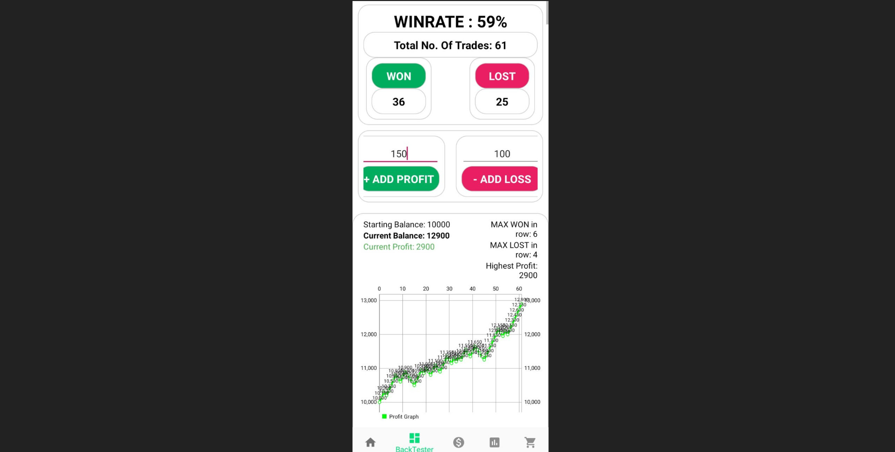

# Easy Money
Easy Money Forex Strategy

## AUDCHF H4
### Indicator:
- 3 EMA - 25,50,100
- VuManChu CipherB - MFI & WaveTrend

### Rules (Long):
- 3 EMA fan-out neatly, ema-25 > ema-50 > ema-100
- MFI is green
- WaveTrend is crossing-up
- 3 last candles is dominated by up-movement
- the last candle's high is the highest high of the 3 last candles
- place buy-stop just above the last high
- place stop loss just below the lowest low of the three last candles
- Risk to reward is 1:1.5
- keep the pending order open as long as the price does not touch the SL

### Rules (short)
- 3 EMA fan-out neatly, ema-25 < ema-50 < ema-100
- MFI is red
- WaveTrend is crossing-down
- 3 last candles is dominated by down-movement
- the last candle's low is the lowest low of the 3 last candles
- place sell-stop just below the last low
- place stop loss just above the highest high of the three last candles
- Risk to reward is 1:1.5
- keep the pending order open as long as the price does not touch the SL

### Example

### Result
quick backtest (Jan 2020 - Aug 2023):

## GBPJPY H4
### Indicator:
- 3 EMA - 25,50,100
- VuManChu CipherB - MFI & WaveTrend

### Rules (Long):
- 3 EMA fan-out neatly, ema-25 > ema-50 > ema-100
- MFI is green
- WaveTrend is crossing-up
- 3 last candles is dominated by up-movement
- place buy-stop just above the last high
- place stop loss just below the lowest low of the three last candles
- Risk to reward is 1:1.5
- keep the pending order open as long as the price does not touch the SL

### Rules (short)
- 3 EMA fan-out neatly, ema-25 < ema-50 < ema-100
- MFI is red
- WaveTrend is crossing-down
- 3 last candles is dominated by down-movement
- place sell-stop just below the last low
- place stop loss just above the highest high of the three last candles
- Risk to reward is 1:1.5
- keep the pending order open as long as the price does not touch the SL

### Example

### Result
quick backtest (Jan 2020 - Aug 2023):

(under construction)